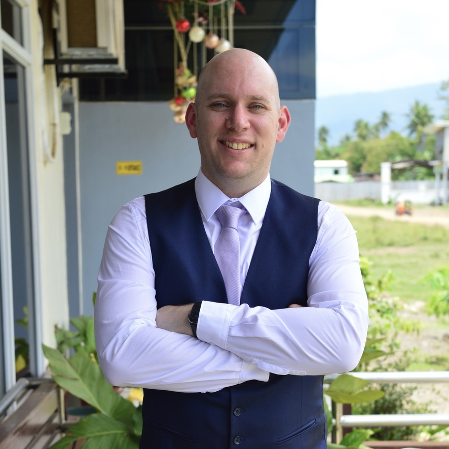

  
  <h1>Hi, I'm Ben 👋</h1>
  
<strong>Entrepreneur · Software Engineer · Belgium 🇧🇪</strong>

---

## About Me

I'm a founder and software engineer based in Bornem, Belgium. I build products and companies across software development, AI, and marketing — all under the **Swiftly** brand.

## Companies I Founded

| Company | What it does |
|---------|-------------|
| [Swiftly Workspace](https://swiftly-workspace.com) | AI-native business operating system — CRM, operations, finance & projects in one platform |
| [Swiftly Developed](https://swiftly-developed.com) | Software development studio for native iOS, Android, web & backend applications |
| [Swiftly Marketing](https://www.swiftly-marketing.com) | Dedicated marketing teams for European SMEs |
| [Swiftly Business Consulting](https://swiftly-business-consulting.com) | Embedded operational consulting for growing European companies |
| [FeedbackKit](https://www.getfeedbackkit.com) | Collect and prioritize user feedback across platforms |
| [Swiftly AIKit](https://www.getswiftly.ai) | Unified API gateway for multiple AI providers |

## Open Source

- [**Swiftly-PDFKit**](https://github.com/Swiftly-Developed/Swiftly-PDFKit) — A convenience PDFKit to create PDF documents in Swift
- [**Swiftly-CMSKit**](https://github.com/Swiftly-Developed/Swiftly-CMSKit) — A CMS for Vapor websites

## Connect

- 🌐 [swiftly-workspace.com](https://swiftly-workspace.com)
- 💼 [LinkedIn](https://www.linkedin.com/in/ben-van-aken/)
- 🐦 [@Mr_Swiftly](https://x.com/Mr_Swiftly)
